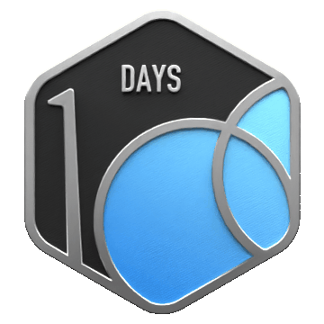

# Hi 👋, I'm Soumya Ranjan Tripathy

**Full Stack Developer @ InnoWaft Solutions** | **Ex-Associate Analyst @ Deloitte**  
Building scalable web systems, clean architecture & production-ready code.

**Tech Stack**  

**🔥 LeetCode Metrics**  
**170+ Problems** · **1414 Rating** · **63-Day Streak** · **100+ Active Days**  

🤝 Connect with me if you like my work, consider starring my repositories :)

