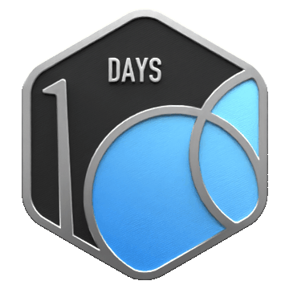

# Hi👋, I'm Soumya Ranjan Tripathy

**Full Stack Developer @ InnoWaft Pvt Ltd** | **Ex-Associate Analyst @ Deloitte**  
Building Scalable web systems with clean architecture & production-ready code using MERN Stack.

**Tech Stack**  

**LeetCode Metrics**  
**Solved 350+ Problems** · **Global Ranking - 354,105** . **1414 Rating** · **7 Months Streak** · **150+ Active Days**  

&nbsp;&nbsp;

  

🤝 Connect with me if you like my work & consider ⭐ starring my repositories :)

